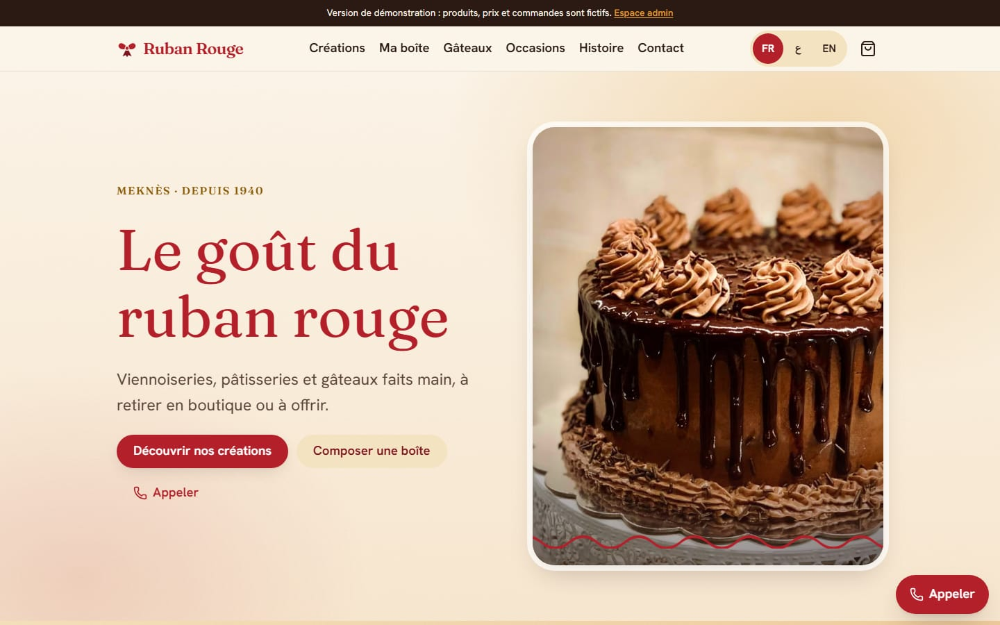
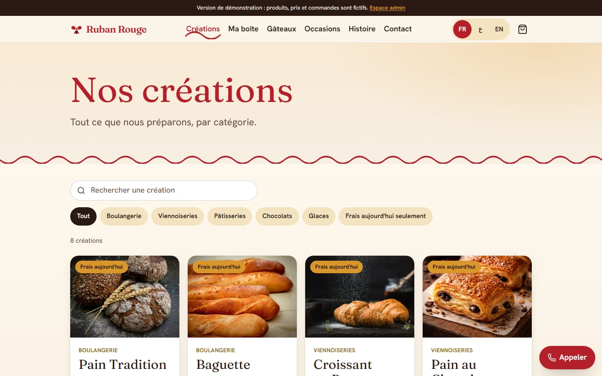
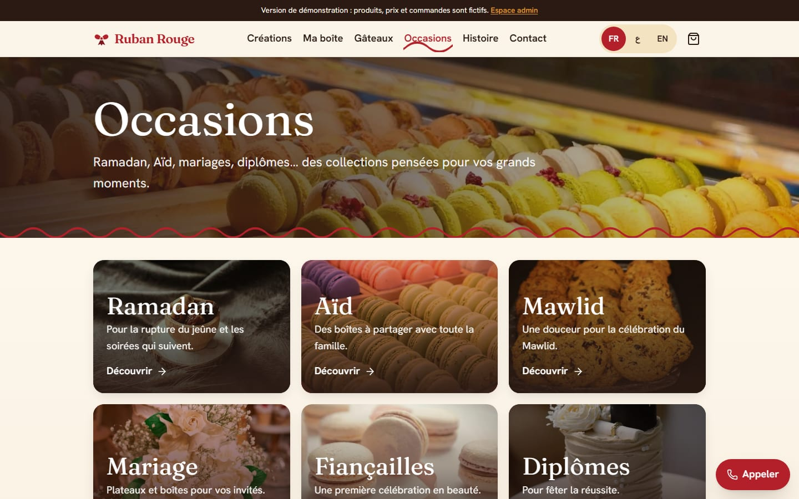
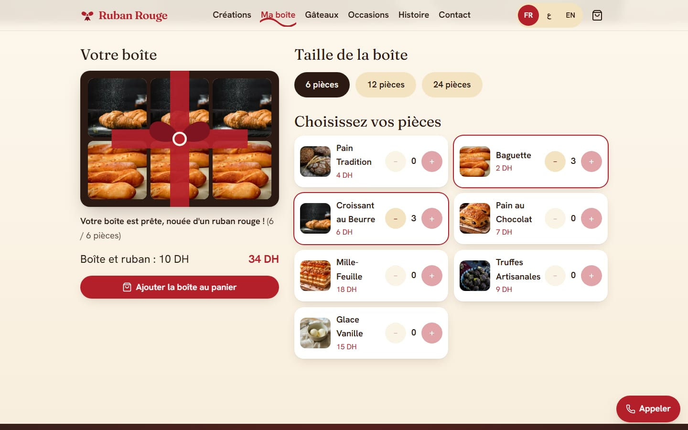
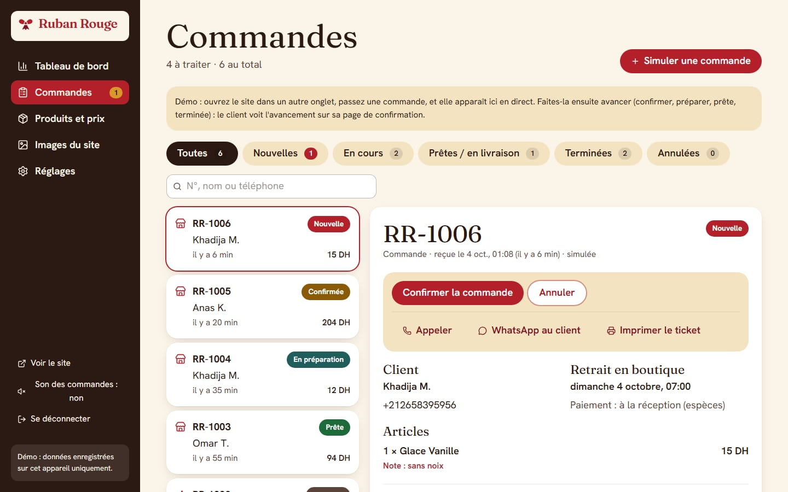
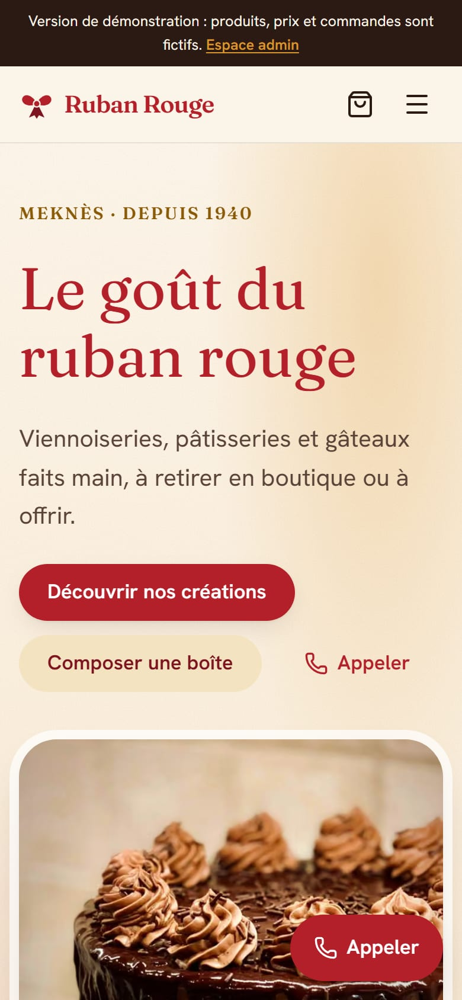
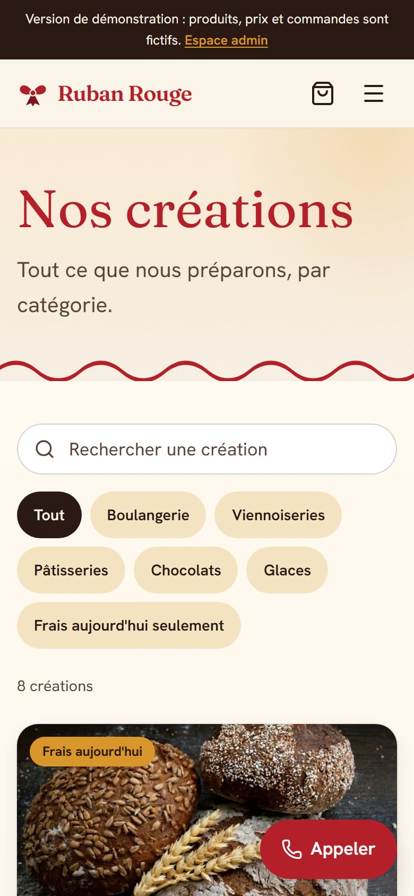

# Ruban Rouge

[](https://github.com/AbdallaouiMed/Ruban_Rouge_Order_Site/actions/workflows/ci.yml)

Website for **Ruban Rouge**, a bakery and pastry shop in Meknès: catalogue, online ordering (pickup or delivery in Meknès, pay on receipt), Build-Your-Own-Box, custom Cake Studio, occasion collections, gifts, a "fresh today" board, and an admin dashboard. French, Arabic (right-to-left) and English.

> **Status: front-end complete, running in demo mode.** Orders, the cart and the admin run entirely in the browser with placeholder prices. There is no server, no real admin login and no payment yet. See [Going live](#going-live).

## Screenshots

| Home | Menu |
|---|---|
|  |  |

| Occasion collections | Build your own box (the red ribbon ties when it is full) |
|---|---|
|  |  |

| Admin: live orders | On a phone |
|---|---|
|  |   |

> The photos are placeholders (stock photography), not the bakery's own products. See [Photography and colour grading](#photography-and-colour-grading).

## Run it

Requires Node 20 or newer (developed on Node 24).

```bash
git clone https://github.com/AbdallaouiMed/Ruban_Rouge_Order_Site.git
cd Ruban_Rouge_Order_Site
npm install
npm run dev        # http://localhost:3000  (French by default)
```

| Command | What it does |
|---|---|
| `npm run dev` | Development server |
| `npm run build` / `npm start` | Production build and server |
| `npm run typecheck` | TypeScript, strict |
| `npm run lint` | ESLint |
| `npm test` | Unit tests (Vitest) |
| `npm run test:e2e` | End-to-end tests (Playwright) at 360, 768, 1024 and 1440 px. Run `npx playwright install chromium` once, and `npm run build` first |
| `npm run check:contrast` | WCAG contrast of every palette pair |
| `npm run check:placeholders` | Lists everything the owners still have to provide |

Open the site at `/fr`, `/ar` or `/en`. The admin is at `/fr/admin` (the demo password is shared by the developer, not shown on the page).

## The demo admin

Open `/fr/admin` and sign in with the demo password (`DEMO_ADMIN_PASSWORD` in `src/lib/demo/config.ts`). It is French only.

- **Orders**: orders placed on the public site arrive live (try it: keep the admin open, place an order in another tab). Move each one through *Nouvelle → Confirmée → En préparation → Prête (or En livraison) → Terminée*, or cancel it with a reason. The customer's confirmation page follows the status live. Print a kitchen ticket, call or WhatsApp the customer. "Simuler une commande" creates a sample order.
- **Produits et prix**: change a price, mark *fresh today* or *sold out*, upload a product photo. A product with no price or marked sold out cannot be ordered.
- **Images du site**: replace the home photo, the story photo and the occasions banner.
- **Réglages**: opening hours (which drive the "open now" badge and the pickup slots), delivery fee, free-delivery threshold, minimum order, preparation lead time, box fee.

Everything is stored in the browser's `localStorage` on the device you use. "Réinitialiser la démo" (in Réglages) wipes it.

## Where things are

| Path | What |
|---|---|
| `src/data/bakery.ts` | **The single source of truth for business facts** (name, address, phones, hours, categories, product names). Unknown values are `TODO_OWNER`. |
| `src/data/demo.ts` | **Placeholder data**: demo prices, availability, cake options, occasions and bundles. Owners confirm or replace all of it. |
| `messages/{fr,en,ar}.json` | Interface text. All three files must have the same keys (a test enforces it). |
| `src/lib/` | Pure logic: `pricing`, `slots`, `orders` (validation and the order workflow), `catalog`, `hours`, `whatsapp`, … fully unit-tested. |
| `src/lib/demo/` | Demo-mode stores (cart, orders, admin edits) in `localStorage`. Replaced by the backend later. |
| `src/app/[locale]/(site)/` | Public pages. `(admin)/admin/` is the demo admin. |
| `src/app/api/contact/` | Contact form API (validation, honeypot, rate limit, Turnstile, store and notify adapters). |
| `tests/unit`, `tests/e2e` | Unit and end-to-end tests. |
| `specs/ruban-rouge.spec.md` | Requirements and acceptance criteria. |

### Editing content

- **A fact** (phone, address, hours): `src/data/bakery.ts`. The footer, contact page, structured data and slot picker all read from it.
- **Text**: `messages/*.json`, in all three languages.
- **Prices, availability, hours, photos** (while in demo mode): the admin.
- **The look**: design tokens are in `src/app/globals.css` (palette, type scale, radii, shadows). Colour pairs are checked by `npm run check:contrast`.
- **Real product photos**: upload them in the admin, or, for permanent images, put files in `public/images/` and set `image` on the product in `src/data/bakery.ts`.

## Photography and colour grading

The site ships with **placeholder photographs** (see `public/images/CREDITS.md`): free-to-use Unsplash stock plus the three pastry shots the old site had, all cropped to their slot and graded into one warm look. **They are not photos of Ruban Rouge's own products.** Replace them before launch: upload from the admin (*Produits et prix* for each product, *Images du site* for the hero, story and page banners), or put real files in `public/images/` and point the defaults in `src/data/demo.ts` and `image` in `src/data/bakery.ts` at them. A test checks that every referenced image exists, has the right proportions and stays light.

Colour grading lives in `src/app/globals.css`: warm tonal steps (peach, honey, blush, ruby) for section backgrounds, a glowing hero, a faint film grain, and a graded cocoa footer. Every new tone is in the contrast check (`npm run check:contrast`).

## Design

Warm boutique pâtisserie, "paper, ribbon and butter". The red ribbon is the recurring motif: wavy dividers, the active-nav underline, the ribbon that ties a full box, the gift cards. Fonts: Fraunces and Hanken Grotesk, with El Messiri and Readex Pro for Arabic. Motion is short and switched off under `prefers-reduced-motion`. A preview of the whole system is at `/fr/design-system` (not indexed).

## Quality gates

- Strict TypeScript, ESLint, 128 unit tests, about 375 end-to-end checks (flows at 360 and 1440 px, layout at 360, 768, 1024 and 1440, in French, Arabic and English), and automated accessibility scans (axe, WCAG 2.2 AA, plus heading order and landmarks) on every page.
- Security headers and a Content-Security-Policy on every response; escaped email output; no secrets in the browser; row-level security on the database table; honeypot, rate limit and Turnstile on the contact form.
- Prices are always recomputed from the catalogue when an order is created. The cart never carries prices.

## Performance

Lighthouse on the production build (blocking the antivirus script this machine injects into pages): Accessibility 98-100, Best Practices 100, SEO 100. Performance is 95-99 on the desktop profile and about 70-86 on the throttled mobile profile (Largest Contentful Paint 3.3-4.7 s with a slow-4G, 4x-slower-CPU simulation). Fonts were cut from 256 KB to 72 KB (Arabic faces load only on Arabic pages, no variable axes), the cart drawer loads on first tap, and product and footer links are not prefetched. The remaining time is mostly the React and Next runtime. Re-measure on the real host (PageSpeed Insights) once it is deployed behind a CDN, since local numbers are pessimistic.

## Going live

The launch build refuses to run until this list is done (`RR_LAUNCH=1 npm run build`, or any Vercel production deploy, runs `scripts/check-placeholders.mjs --strict`).

1. **Owners provide**: real prices, descriptions and allergens; real product and hero photos; delivery fee, zone and lead times; the WhatsApp number; real customer reviews (none are shown until then); confirmation of the story text; the domain and the logo. `npm run check:placeholders` lists every open item.
2. **Build the real back end** (the code is designed for it: the demo stores and the contact adapters sit behind small interfaces):
   - Supabase Postgres for orders, products, availability and settings; run `supabase/migrations/`. Row-level security on, no public policies.
   - Real admin: Supabase Auth with server-side checks on every change. **The demo admin and its password are not security**: they ship in the page bundle.
   - Server-side order creation: `createOrder` in `src/lib/orders.ts` is already the single validation and pricing function; call it from a route handler.
   - Resend for email (set `RESEND_API_KEY`, `RESEND_FROM`), optional Notion mirror (`NOTION_TOKEN`, `NOTION_DATABASE_ID`), Cloudflare Turnstile (`NEXT_PUBLIC_TURNSTILE_SITE_KEY`, `TURNSTILE_SECRET_KEY`). See `.env.example`. Never commit real values.
3. **Turn demo mode off**: set `NEXT_PUBLIC_DEMO_MODE=0`. This hides the demo banner, 404s the demo admin and removes placeholder prices and availability.
4. **Harden**: replace the in-memory rate limiter with a shared store (Upstash or the database). The Content-Security-Policy in `next.config.ts` already allows only Turnstile and Google Maps; its `script-src` still needs `'unsafe-inline'` for Next's inline bootstrap, so move to nonces (dynamic rendering) or Subresource Integrity when you can.
5. **Privacy**: add a privacy notice to the contact and checkout forms and decide how long customer data is kept. Delete `/fr/design-system` or keep it out of production.
6. Set `NEXT_PUBLIC_SITE_URL` to the real domain (used for canonical links, hreflang, the sitemap and structured data).

### Deploying

The app is a standard Next.js project and deploys to Vercel: import the repository and deploy. `vercel.json` pins the region to Paris (`cdg1`, closest to Meknès).

- **Showcase (demo) deploy**: set `RR_SHOWCASE=1`. This is the one deliberate way past the launch gate, for showing the demo to a client. The site keeps its demo banner, orders stay in each visitor's browser, the contact form accepts and discards messages, and it is **not indexed** (`robots.txt` disallows everything and pages carry `noindex`). Optionally set `NEXT_PUBLIC_SITE_URL` to the deployed address; otherwise the Vercel production URL is used.
- **Real launch**: leave `RR_SHOWCASE` unset and finish [Going live](#going-live). A production deploy then fails until the placeholders are gone and demo mode is off.

The GitHub Actions workflow in `.github/workflows/ci.yml` runs the type check, lint, unit tests, build and end-to-end tests on every push and pull request.

## Known limitations of the demo

- Data lives in one browser. Another device or browser sees none of it.
- The admin is French only.
- Online payment is not implemented: cash on pickup or delivery, behind a place where a payment provider will plug in.
- The slot picker, "open now" badge and cake-date rule use the shop's local time (Africa/Casablanca).
- Pre-order windows for Ramadan, Eid and Mawlid say "dates to be confirmed".
- Subscriptions, the loyalty stamp card and the "Which treat are you?" quiz are not built.
